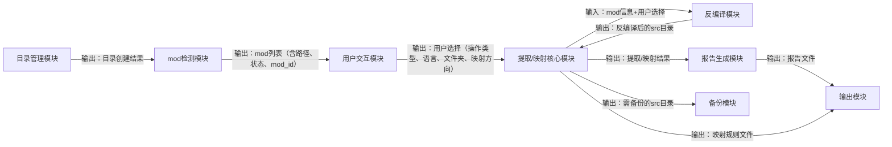

## 1. 项目结构分析

### 1.1 Localization_Tool/src 结构分析

**核心模块划分**：
- `common/`: 通用工具模块，包含配置管理、文件操作、日志等基础功能
- `extract_mode/`: 提取模式核心模块，负责从源文件提取字符串
- `extend_mode/`: 映射模式核心模块，负责字符串映射
- `localization/`: 本地化相关功能
- `performance/`: 性能相关功能
- `ui/`: 用户界面模块

**文件类型分布**：
- Python文件：27个
- Markdown文档：3个
- 文本文件：1个
- 编译缓存：35个

**现有问题**：
- 文件夹对文件夹映射方式效率低，不够灵活
- 映射逻辑与文件操作耦合度高
- 缺少清晰的模块间接口定义
- 错误处理机制不够完善

### 1.2 Localization_File 结构分析

**核心目录**：
- `output/`: 输出目录，包含提取结果、映射结果和报告
- `rule/`: 映射规则目录，包含中英文映射规则
- `source/`: 源文件目录，包含待处理的mod文件
- `source_backup/`: 源文件备份目录

**现有问题**：
- 目录结构复杂，层级过多
- 缺乏统一的文件命名规范
- 备份机制不够完善
- 报告生成逻辑分散

## 2. 系统流程图实现

已按照要求设计新的系统流程图，采用Mermaid语法表示：



## 3. 新映射机制设计

### 3.1 规则文件格式规范

**JSON格式**：
```json
{
  "version": "1.0",
  "mod_info": {
    "name": "Aptly Simple Hullmods",
    "version": "2.1.2c",
    "mod_id": "aptlysimplehullmods"
  },
  "mapping_rules": [
    {
      "id": "rule_001",
      "source_string": "Simple Hullmods",
      "target_string": "简单船插",
      "context": "aptlysimplehullmods.aptlysimplehullmods",
      "status": "mapped",
      "last_updated": "2025-12-14T22:30:00Z"
    }
  ],
  "metadata": {
    "created_at": "2025-12-14T22:30:00Z",
    "created_by": "localization_tool",
    "language_pair": "en-zh"
  }
}
```

**YAML格式**：
```yaml
version: "1.0"
mod_info:
  name: "Aptly Simple Hullmods"
  version: "2.1.2c"
  mod_id: "aptlysimplehullmods"
mapping_rules:
  - id: "rule_001"
    source_string: "Simple Hullmods"
    target_string: "简单船插"
    context: "aptlysimplehullmods.aptlysimplehullmods"
    status: "mapped"
    last_updated: "2025-12-14T22:30:00Z"
metadata:
  created_at: "2025-12-14T22:30:00Z"
  created_by: "localization_tool"
  language_pair: "en-zh"
```

### 3.2 解析逻辑

1. **规则文件加载**：
   - 支持JSON和YAML格式
   - 自动检测文件格式
   - 支持批量加载多个规则文件

2. **规则解析**：
   - 验证规则文件格式正确性
   - 提取mod_info、mapping_rules和metadata
   - 建立字符串映射索引

3. **规则匹配**：
   - 基于字符串内容匹配
   - 支持上下文匹配
   - 支持正则表达式匹配（可选）

### 3.3 映射执行流程

1. **提取阶段**：
   - 从源文件提取字符串
   - 生成初始规则文件（未映射状态）
   - 保存规则文件到指定目录

2. **映射阶段**：
   - 加载规则文件
   - 读取源文件内容
   - 匹配并替换字符串
   - 生成映射后的文件
   - 更新规则文件状态

3. **后处理阶段**：
   - 验证映射结果
   - 生成映射报告
   - 备份原始文件

## 4. 新程序框架设计

### 4.1 模块划分

| 模块名称 | 核心功能 | 输入 | 输出 |
|---------|---------|------|------|
| 目录管理模块 | 创建/验证目录结构 | 配置信息 | 目录创建结果 |
| mod检测模块 | 检测并收集mod信息 | 源目录路径 | mod列表（含路径、状态、mod_id） |
| 用户交互模块 | 处理用户输入 | 命令行参数/交互输入 | 用户选择（操作类型、语言、映射方向） |
| 提取/映射核心模块 | 核心业务逻辑 | mod信息+用户选择+规则文件 | 提取/映射结果 |
| 反编译模块 | 反编译jar文件 | jar文件路径 | 反编译后的src目录 |
| 规则管理模块 | 规则文件处理 | 规则文件路径 | 解析后的规则 |
| 报告生成模块 | 生成执行报告 | 执行结果 | 报告文件 |
| 备份模块 | 备份源文件 | 源文件路径 | 备份结果 |
| 输出模块 | 输出处理结果 | 处理结果 | 输出文件/目录 |

### 4.2 接口定义

```python
# 目录管理模块接口
def create_directories(config: Dict[str, Any]) -> bool: ...
def validate_directories(config: Dict[str, Any]) -> bool: ...

# mod检测模块接口
def detect_mods(source_path: str) -> List[Dict[str, Any]]: ...
def get_mod_info(mod_path: str) -> Dict[str, Any]: ...

# 用户交互模块接口
def get_user_choice(mods: List[Dict[str, Any]]) -> Dict[str, Any]: ...

def parse_command_line(args: List[str]) -> Dict[str, Any]: ...

# 提取/映射核心模块接口
def extract_strings(mod_info: Dict[str, Any], source_path: str) -> Dict[str, Any]: ...

def map_strings(mod_info: Dict[str, Any], source_path: str, rules: List[Dict[str, Any]]) -> Dict[str, Any]: ...

# 反编译模块接口
def decompile_jar(jar_path: str, output_path: str) -> bool: ...

# 规则管理模块接口
def load_rules(rule_path: str) -> List[Dict[str, Any]]: ...

def save_rules(rules: List[Dict[str, Any]], output_path: str) -> bool: ...

def update_rule_status(rule_id: str, status: str) -> bool: ...

# 报告生成模块接口
def generate_report(result: Dict[str, Any], output_path: str) -> bool: ...

# 备份模块接口
def backup_files(source_path: str, backup_path: str) -> bool: ...

# 输出模块接口
def write_output(content: Any, output_path: str) -> bool: ...

def copy_files(source_path: str, target_path: str) -> bool: ...
```

### 4.3 数据流向

1. **配置加载**：
   - 从配置文件加载系统配置
   - 初始化日志和其他基础组件

2. **目录准备**：
   - 创建/验证必要的目录结构
   - 确保输出和规则目录存在

3. **Mod检测**：
   - 检测源目录中的mod
   - 收集mod信息（路径、状态、mod_id）

4. **用户交互**：
   - 获取用户选择（操作类型、语言、映射方向）
   - 处理命令行参数

5. **核心处理**：
   - 根据用户选择执行提取或映射操作
   - 调用反编译模块处理jar文件
   - 调用规则管理模块加载/保存规则

6. **结果输出**：
   - 生成报告
   - 输出处理结果
   - 备份原始文件

### 4.4 核心算法设计

1. **字符串提取算法**：
   - 使用Tree-sitter解析源代码
   - 提取注释和字符串常量
   - 生成结构化的提取结果

2. **字符串映射算法**：
   - 基于规则文件的字符串替换
   - 支持精确匹配和上下文匹配
   - 处理嵌套字符串和转义字符

3. **Mod检测算法**：
   - 遍历源目录
   - 识别mod_info.json文件
   - 提取mod_id和其他元数据

### 4.5 错误处理机制

1. **异常层次结构**：
   - `LocalizationError`：基础异常类
   - `ConfigError`：配置相关错误
   - `FileError`：文件操作相关错误
   - `ParseError`：解析相关错误
   - `MappingError`：映射相关错误

2. **错误处理策略**：
   - 捕获并记录详细错误信息
   - 提供友好的错误提示
   - 支持错误恢复机制
   - 生成详细的错误报告

### 4.6 扩展点和配置项

**扩展点**：
- 支持自定义提取器插件
- 支持自定义映射器插件
- 支持自定义报告生成器插件
- 支持自定义文件处理器插件

**配置项**：

| 配置项 | 类型 | 默认值 | 描述 |
|-------|------|--------|------|
| `tool_root` | string | 自动检测 | 工具根目录 |
| `mod_root` | string | 自动检测 | Localization_File目录 |
| `output_dir` | string | `output` | 输出目录 |
| `rule_dir` | string | `rule` | 规则文件目录 |
| `source_dir` | string | `source` | 源文件目录 |
| `backup_dir` | string | `source_backup` | 备份目录 |
| `log_level` | string | `INFO` | 日志级别 |
| `rule_format` | string | `json` | 规则文件格式 |
| `enable_backup` | bool | `true` | 是否启用备份 |
| `enable_report` | bool | `true` | 是否生成报告 |

## 5. 实现计划

### 5.1 阶段1：基础框架搭建
- 实现核心模块接口定义
- 实现配置管理功能
- 实现目录管理模块
- 实现日志记录功能

### 5.2 阶段2：核心功能实现
- 实现mod检测模块
- 实现反编译模块
- 实现规则管理模块
- 实现报告生成模块

### 5.3 阶段3：业务逻辑实现
- 实现提取功能
- 实现映射功能
- 实现用户交互模块
- 实现输出模块

### 5.4 阶段4：测试与优化
- 单元测试
- 集成测试
- 性能测试
- 优化代码结构
- 完善文档

### 5.5 阶段5：部署与迁移
- 生成部署脚本
- 编写迁移指南
- 提供示例配置

## 6. 可优化点

1. **性能优化**：
   - 使用多线程/多进程处理多个mod
   - 优化文件I/O操作
   - 实现增量提取和映射

2. **用户体验优化**：
   - 提供更友好的命令行界面
   - 支持GUI界面（可选）
   - 提供更详细的帮助信息

3. **扩展性优化**：
   - 支持更多文件格式
   - 支持更多语言对
   - 支持插件机制

4. **可靠性优化**：
   - 增强错误处理
   - 实现事务处理
   - 提供回滚机制

## 7. 预期成果

1. **更灵活的映射机制**：
   - 基于规则文件的映射，支持更复杂的映射需求
   - 支持增量映射和部分映射
   - 支持多种规则文件格式

2. **更清晰的代码结构**：
   - 模块化设计，便于维护和扩展
   - 明确的接口定义，便于测试
   - 清晰的数据流向，便于调试

3. **更完善的功能**：
   - 支持更多的文件类型和语言
   - 提供更详细的报告
   - 增强的错误处理

4. **更好的用户体验**：
   - 更友好的命令行界面
   - 更详细的帮助信息
   - 更灵活的配置选项

通过以上重构，本地化工具将变得更加灵活、可靠和易于维护，能够更好地满足用户的本地化需求。